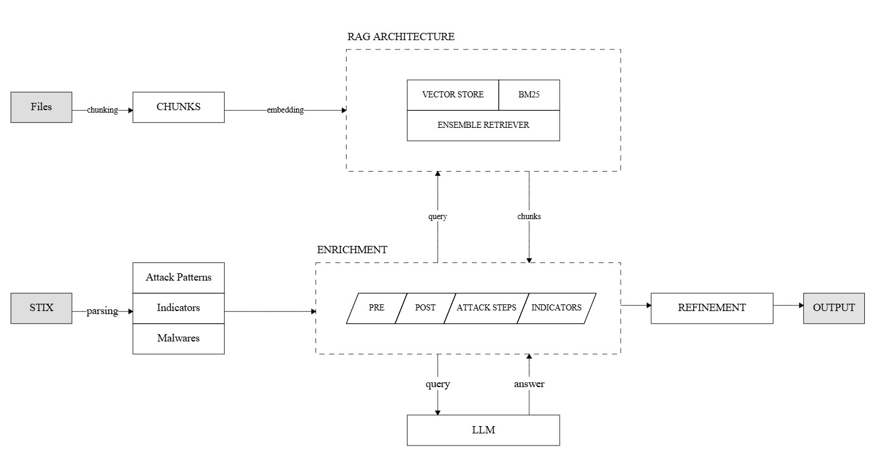

# Creating Actionable Rich Threat Intelligent Reports Merging Structured and Narrative Information Through Large Language Models

## Abstract
Effective cyber threat intelligence hinges on data collection and the ability to swiftly contextualize and act on that data. While STIX (Structured Threat Information Expression) provides a standardized format for sharing threat indicators, it often lacks the actionability analysts require. This work presents a novel pipeline powered by Large Language Models (LLMs) that, starting from a STIX file and additional documents related to a specific cyber threat, produces a graph-based representation of such a threat, capturing the temporal evolution of the represented cyber attack. Each node in the graph corresponds to a specific attacker action and is associated with a natural-language description of such action. Thus, the pipeline produces a representation of the threat with a higher level of detail with respect to the original STIX file. The resulting system bridges the gap between raw threat data and informed, rapid decision-making.

## Pipeline Overview

In this section, we match the components described in the schema above with the code's components provided in this repository.

The STIX file and the additional documents, previously retrieved manually, must be inserted in the proper directories.

Users should verify the configuration file in `config/config.json` before executing the pipeline.

### Configuration File
This file allows users to customize their implementation, configuring the parameters as follows:
- `STIX_FILE`: the path of the STIX file.
- `DOCUMENTS_DIR`: the directory containing the additional files.
- `OUTPUT_DIR`: the output directory. It will contains the log file and the output JSON.
- `OUTPUT_FILE`: the name of the output file. Note that the `SELECTED_INTERACTION_LEVEL` will be inserted at the start of the filename.
- `MODELS`: the models to use in the pipeline. In particular, it requires the name of the `TEXT_GENERATION` and the `SENTENCE_TRANSFORMER` models.
- `CHUNK_SIZE`: the size of the chunks to generate when processing the additional documents.
- `CHUNK_OVERLAP`: the overlap (%) between the chunks when processing the additional documents.
- `k`: the chunks to be retrieved by the semantic search
- `BM25_k`: the number of chunks to be retrieved by keyword search.
- `N_TECHNIQUES`: number of techniques to select to be provided to the LLM.
- `INTERACTION_LEVELS`: thresholds for the defined human interaction levels.
- `SELECTED_INTERACTION_LEVEL`: human interaction level to be used.
- `DUPLICATE_THRESHOLD`: threshold used to refine the Pre and Post conditions.

### Application File
The whole pipeline is implemented by the script `app.py`, importing relevant utilities from the `/src` folder and its subfolders.
To parse the STIX file and extract the interesting objects we implemented the class `src/STIXParser.py`.
The script `src/DocumentFactory.py` implements the chunking strategies for the different files type.
Then, in the `/src/stores` folder there is the wrapper for the vector database.

## Usage
To run the application, the user must:
1. Prepare the STIX file and the additional resources.
2. Modify the configuration file according to the requirements.
3. Install the requirements by running `python -m pip install -r requirements.txt`. using a virtual environment is strongly suggested.
4. Once the requirements has been installed, run the pipeline using `python app.py`
5. When the pipeline finishes the execution, in the `OUTPUT_DIR` folders there will be the execution log and the output JSON.

## Additional Files
Together with the main application, we provide two additional scripts:
- `report.py` to generate the PDF report.
- `show_graph.py` to generate the HTML figure representig the output graph.

## Results
In the `/results` folder we provide the fives evaluations perfomed. Each subfolder details one of them.
- **Case 1**: Goofy Guineapig
- **Case 2**: Smooth Operator
- **Case 3**: Small Sieve
- **Case 4**: Jaguar Tooth
- **Case 5**: COLDSTEEL

Into these subfolders we stored the application log, the output JSON, the PDF report and the HTML visualization and the time and F1 score measures performed using the script `measures.py`.

- `app.log` contains the execution details. From it, it is possible to determine the documents used to generate the responses.
- `execution_scores_XX.log` recorded the precision, recall and F1 score computed during the evaluations. The ground truth we used are in the folder `ground_truths`.
- `execution_times_XX.log` stores the execution times.
- `XX_graph_plot.png` contains the plot of the graph representing the attack.
- `XX_report.pdf` is the automatic report generated from the application output.
- `graph.html` contains the HTML visualization of the graph.
- `LOW_output.json` is the main output of the pipeline, detailing the related attack. This output was generated with a LOW human-interaction level.

Moreover, the STIX used as references are stored in the folder `sample_stix`.