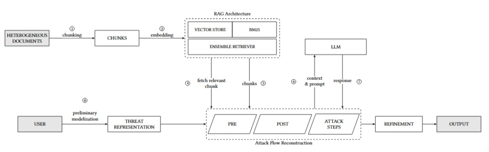

# Merging Narrative and Structured Information Through LLMs for Actionable Rich Threat Representation

## Abstract
Modern cybersecurity operations rely on Cyber Threat Intelligence (CTI) collected from heterogeneous sources, including semi-structured threat representations, Indicators of Compromise (IoCs), and narrative technical reports. However, these artifacts are often insufficient in isolation to reconstruct how an attack unfolds, under which conditions each step is feasible, and which traces it leaves behind. In practice, analysts must manually correlate partial evidence scattered across multiple and only partially structured sources, delaying the design of effective prevention, detection, and response actions.

To address this gap, we propose an automated pipeline that derives an actionable representation of a cyberattack from heterogeneous CTI sources. The pipeline combines a Retrieval-Augmented Generation (RAG) architecture, used to retrieve step-relevant evidence from dispersed documents, with a locally deployable Small Language Model (SLM), used to consolidate such evidence and infer missing operational details. Starting from a semi-structured threat representation and auxiliary CTI documents, the pipeline produces an enriched Attack Graph that captures the step-wise evolution of the attack and annotates each step with an enriched description, explicit pre-conditions, and explicit post-conditions. This
representation supports prevention by exposing execution requirements, detection by highlighting observable traces, and response by clarifying
the temporal progression of the attack.

Then, due to the lack of validated datasets with ground-truth information on the temporal evolution of real-world attacks, we test the complete pipeline on 10 real-world case studies spanning multiple threat types,
including backdoors and staged downloaders delivered via phishing. A manual assessment confirms that the generated Attack Graphs are consistent with the expected attack progressions, indicating that the proposed approach can support analysts by consolidating dispersed CTI evidence into a structured and comprehensive view of attacks.

## Pipeline Overview

In this section, we match the components described in the schema above with the code's components provided in this repository.

The heterogeneous documents and the intermediate representation (e.g., STIX file), must be inserted in the proper directories.

Users should verify the configuration file in `config/config.json` before executing the pipeline.

### Configuration File
This file allows users to customize their implementation, configuring the parameters as follows:
- `STIX_FILE`: the path of the STIX file.
- `DOCUMENTS_DIR`: the directory containing the additional files.
- `OUTPUT_DIR`: the output directory. It will contains the log file and the output JSON.
- `OUTPUT_FILE`: the name of the output file. Note that the `SELECTED_INTERACTION_LEVEL` will be inserted at the start of the filename.
- `MODELS`: the models to use in the pipeline. In particular, it requires the name of the `TEXT_GENERATION`, the `SENTENCE_TRANSFORMER`, and `MITRE_MATCH` models.
- `CHUNK_SIZE`: the size of the chunks to generate when processing the additional documents.
- `CHUNK_OVERLAP`: the overlap (%) between the chunks when processing the additional documents.
- `k`: the chunks to be retrieved by the semantic search
- `BM25_k`: the number of chunks to be retrieved by keyword search.
- `N_TECHNIQUES`: number of techniques to select to be provided to the LLM.
- `INTERACTION_LEVELS`: thresholds for the defined human interaction levels.
- `SELECTED_INTERACTION_LEVEL`: human interaction level to be used.
- `DUPLICATE_THRESHOLD`: threshold used to refine the Pre and Post conditions.

### Application File
The whole pipeline is implemented by the script `app.py`, importing relevant utilities from the `/src` folder and its subfolders.
This implementation uses STIX as intermediate representaion. To parse the STIX file and extract the interesting objects we implemented the class `src/STIXParser.py`.
The script `src/DocumentFactory.py` implements the chunking strategies for the different files type.
Then, in the `/src/stores` folder there is the wrapper for the vector database.

## Usage
To run the application, the user must:
1. Prepare the intermediate representation and the heterogeneous documents.
2. Modify the configuration file according to the requirements.
3. Install the requirements by running `python -m pip install -r requirements.txt`. Using a virtual environment is strongly suggested.
4. Once the requirements has been installed, run the pipeline using `python app.py`
5. When the pipeline finishes the execution, in the `OUTPUT_DIR` folders there will be the execution log and the output JSON.

## Additional Files
Together with the main application, we provide two additional scripts:
- `report.py` to generate the PDF report.
- `show_graph.py` to generate the HTML figure representig the output graph.

## Results
In the `/results` folder we provide the fives evaluations perfomed. Each subfolder details one of them.
- **Case 1**: Goofy Guineapig
- **Case 2**: Smooth Operator
- **Case 3**: Small Sieve
- **Case 4**: Jaguar Tooth
- **Case 5**: COLDSTEEL
- **Case 6**: Umbrella Stand
- **Case 7**: Pygmy Goat
- **Case 8**: Authentic Antics
- **Case 9**: Damascened Peacock
- **Case 10**: Cheeky Chipmunk

Into these subfolders we stored the application log, the output JSON, the PDF report and the HTML visualization and the time and F1 score measures performed using the script `measures.py`.

- `app.log` contains the execution details. From it, it is possible to determine the documents used to generate the responses.
- `execution_scores_XX.log` recorded the precision, recall and F1 score computed during the evaluations. The ground truth we used are in the folder `ground_truths`.
- `execution_times_XX.log` stores the execution times.
- `XX_graph_plot.png` contains the plot of the graph representing the attack.
- `XX_report.pdf` is the automatic report generated from the application output.
- `graph.html` contains the HTML visualization of the graph.
- `LOW_output.json` is the main output of the pipeline, detailing the related attack. This output was generated with a LOW human-interaction level.

Moreover, the STIX used as references are stored in the folder `sample_stix`. In the `documents`folder, we saved the heterogeneous documents used for each experiment.

## Evaluation of the Chunking strategy, the MITRE matching capabilities of the LLMs, and the RAG hyperparameters
We performed different evaluations both to determine the best chunking strategy, the MITRE matching capabilities of the LLMs, and the RAG hyperparameters. The scripts used and the results are available in the `evaluation`. In particular:
- the folder `chunking` contains an example of the chunking strategy implementation as described by  Smith and Troynikov (https://research.trychroma.com/evaluating-chunking)
- the folder `mitre` contains the evaluation of the matching capabilities of the LLMs
- the folder `rag` contains the evaluations to determine the best RAG hyperparameters
